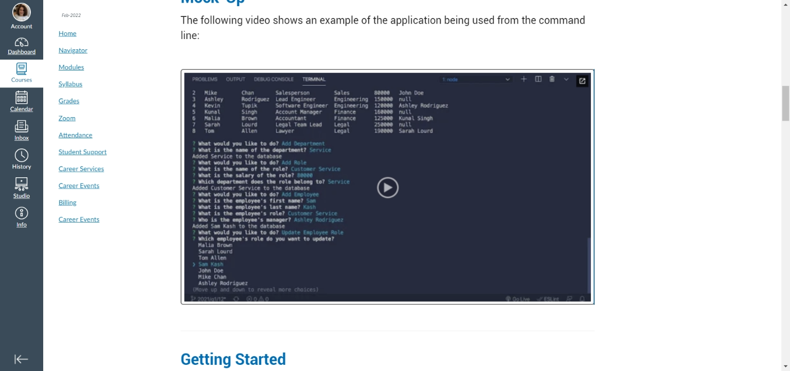

# Title

MYSQL CORPORATE TRACKER

## Description

Use Inquirer package to present a series of questions to a user via a CLI.  The answers would subsequently integrate with MYSQL commands that would enable the user to view and change various aspects of an employee's information through a series of 3 interrelated tables.

The following image illustrates the expected output .

Output is based on the acceptance criteria outlined in the Module 12 Assignment Overview [Module-12-assignment](https://courses.bootcampspot.com/courses/1181/assignments/23358?module_item_id=464333).

## Table of Contents

* [Installation](#installation)
* [Usage](#usage)
* [License](#license)
* [Testing](#testing)
* [Credits](#credits)
* [Questions](#questions)

## Installation

To initiate the series of questions, if my coding were correct, typing in node index.js would bring up the first question asking the user to select an option which would subsequently guide the user through the rest of the program.  MYSQL is initiated by typing in "mysql -u root -p" and then entering a mysql password to bring up the mysql prompt.

## Usage

From the three database tables that are created, Department, Role and Employee, a user can view all departments in a database as well as which employees work in specific departments, their names, titles, salaries and managers.  Additional departments and/or roles and/or employees can be added, updated or deleted, with the "SELECT * FROM tablename mysql command allowing the user to see the results of whatever option was selected in the updated table (or even just the specific row - I prefer to show the full table as it provides a broader perspective).

## License

This application is covered under the MIT license.  [MIT license link](https://choosealicense.com/licenses/mit/)

## Contributing

There is still work to be done, as I need to finish the coding to actually pass the responses from the prompts into the commands for the mysql actions. I also need to to fix whatever error is ending inquirer before allowing a user to enter any information.   Any feedback or assistance is always welcome.

## Testing

None at this time.

## Credits

Some assistance was provided in my weekly tutoring session, although we got stuck on the error noted above.  Additional assistance from the TA's during office hours and a number of visits to the Stack Overflow website [https://stackoverflow.com](https://stackoverflow.com).

## Questions?

If you have any questions, please see my contact details below:

## GitHub Username

My GitHub Username is [username](https://github.com/lnd4812).

## GitHub Repository

My GitHub repository link for this project is [github address](https://github.com/lnd4812/mysql-corporate-tracker)

## Application Video Link

The link to the application video may be accessed at to follow

## Contact information

To contact me directly, please feel free to drop me an e-mail at: <a hef="mailto:laureldavid64@gmail.com">laureldavid64@gmail.com</a>